# ⚡ Autonomous Enterprise Supply Chain Agent


[](https://aws.amazon.com/bedrock/)
[](https://www.python.org/)
[](https://streamlit.io/)
[](https://aws.amazon.com/dynamodb/)

## 📖 Project Overview

This project represents a **Self-Healing Supply Chain System** powered by Generative AI. Unlike traditional rule-based automation, this agent utilizes **AWS Bedrock (Amazon Nova Micro)** to reason through complex market scenarios.

It autonomously monitors inventory levels and competitor pricing, executing strategic decisions to maximize sales while strictly adhering to **profitability guardrails**. The system acts as an "AI Employee," handling procurement and pricing strategies without human intervention, ensuring business continuity during market anomalies like stockouts or price wars.

---

## 🏗️ Tech Stack & Architecture Decisions

| Component | Technology | Why this choice? |
| :--- | :--- | :--- |
| **Brain / Reasoning** | **AWS Bedrock** | Utilizes Amazon Nova Micro for low-latency, cost-effective reasoning on high-frequency tasks. |
| **Backend Logic** | **Python (Boto3)** | Industry standard for AWS SDK interactions and managing Agentic workflows. |
| **Database** | **AWS DynamoDB** | Selected for single-digit millisecond latency, essential for real-time pricing systems. |
| **User Interface** | **Streamlit** | Enables rapid visualization of the Agent's decision-making process and logs. |
| **Notification** | **Amazon SES (Mock)** | Simulates enterprise-grade communication to keep stakeholders informed of autonomous actions. |

---

## 🗺️ Agent Capabilities & System Map

The diagram below illustrates the **"Muscles" (Tools)** of the AI Agent. The Agent acts as a central router, utilizing **Function Calling** to interact with the database and external services.

```mermaid
graph TD;
    %% Nodes
    Market[Start: Market Event] -->|Stockout / Price Change| Dashboard[Streamlit Dashboard];
    Dashboard -->|Trigger Request| Brain[🤖 AI Agent / AWS Bedrock];
    
    subgraph "Agent Muscles (Function Calling)"
        Brain -- Decides Action --> Router{Tool Router};
        
        Router -->|Need Data?| Tool1[Get Product Data];
        Router -->|Price Strategy?| Tool2[Update Price];
        Router -->|Low Stock?| Tool3[Create Restock Order];
        Router -->|Communication?| Tool4[Send Notification];
    end

    subgraph "External Services & Outputs"
        Tool1 -->|Read State| DB[(AWS DynamoDB)];
        Tool2 -->|Write New Price| DB;
        Tool3 -->|Generate PO| Supplier["Supply Chain ERP (Simulated)"];
        Tool4 -->|Dispatch Email| SES["Amazon SES / SMTP Relay"];
    end

    %% Styles
    classDef aws fill:#FF9900,stroke:#232F3e,stroke-width:2px,color:white;
    classDef ai fill:#00C7B7,stroke:#232F3e,stroke-width:2px,color:white;
    class DB,SES,Brain aws;
    class Tool1,Tool2,Tool3,Tool4 ai;
```



---

## 📦 Installation & Setup

### Prerequisites
- Python 3.9+
- AWS Account (with Access Key & Secret Key)
- AWS CLI configured locally

### Step 1: Clone the Repository
```bash
git clone https://github.com/YOUR_USERNAME/autonomous-supply-chain-agent.git
cd autonomous-supply-chain-agent
```

### Step 2: Install Dependencies
```bash
pip install -r requirements.txt
```

### Step 3: Configure AWS Credentials
Ensure your terminal has access to AWS Bedrock and DynamoDB.
```bash
aws configure
# Enter your AWS Access Key ID
# Enter your AWS Secret Access Key
# Region: eu-west-1 (or your preferred region)
```
### Step 4: Initialize Database
Before running the dashboard, you must create the DynamoDB tables and load initial product data. Run these two scripts in order:
```bash
# 1. Create the DynamoDB Table structure (The Skeleton)
python creating_tables/create_data.py

# 2. Populate the table with simulation data (The Content)
python creating_tables/seed_products.py
```

### Step 5: Run the System
Launch the Operation Command Center.
```bash
python -m streamlit run dashboard.py
```

---

## 🧩 Code Deep Dive (Key Components)

Here is a breakdown of the critical logic that powers the agent.

### 1. The "Brain" (Reasoning Loop)
Instead of hard-coded if-else statements, we inject a **System Prompt** that forces the LLM to think like a Supply Chain Manager.
```python
# lambda_function.py
SYSTEM_PROMPT = "You are an Autonomous Enterprise Supply Chain Assistant. Priority: PROFITABILITY..."
# The agent checks if Target Price < Floor Price (Cost * 1.10) -> STOP. Do NOT sell at loss.
```

### 2. The "Muscles" (Tool Configuration)
We define the functions the AI is allowed to use via a JSON schema sent to AWS Bedrock.
```python
# tools.py
tool_config = [
    {
        "toolSpec": {
            "name": "update_product_price",
            "description": "Updates the product price in DynamoDB.",
            "inputSchema": {...}
        }
    }
]
```

---

## 🎮 Simulation Scenarios (How to Demo)

This project is designed to be interactive. Use the buttons in the "Operations Command Center" to inject real-world market anomalies.

### 📉 Scenario 1: The Price War
**Trigger:** Click `Simulate: Drop Competitor (-20 TL)`
- **Observation:** The competitor undercuts our price significantly.
- **Agent Response:** The AI detects the price gap, calculates a competitive yet profitable price, and updates the listing instantly. Sales resume automatically.

### 🛡️ Scenario 2: Profit Protection (The Guardrail)
**Trigger:** Click `Simulate: Drop Competitor` multiple times until the price is critically low (below our cost margin).
- **Observation:** The market price drops below our `Cost + Margin` threshold.
- **Agent Response:** Instead of entering a "Race to the Bottom," the AI **halts sales** and sets the price to the **Floor Limit**.
- **Outcome:** The system prioritizes financial health over raw sales volume, sending a notification: *"Refusing to sell at a loss."*

> **💡 Pro Tip:** You can also trigger the simulation buttons (Stockout/Price Drop) **after** clicking **"Stop Simulation"**. This allows you to inspect the Agent's reaction to single-state changes step-by-step without the continuous simulation loop.

---

## 📬 Contact

**Developer:** Ahmet Değirmencioğlu  
**Focus:** Industrial Engineering & Generative AI Agents

*Powered by AWS Bedrock, DynamoDB, and Python.*
